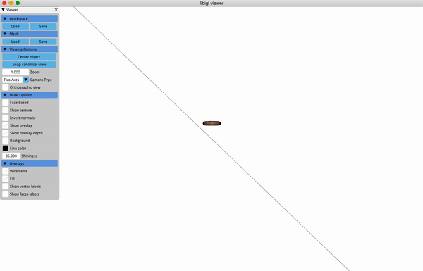
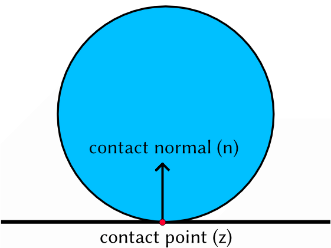
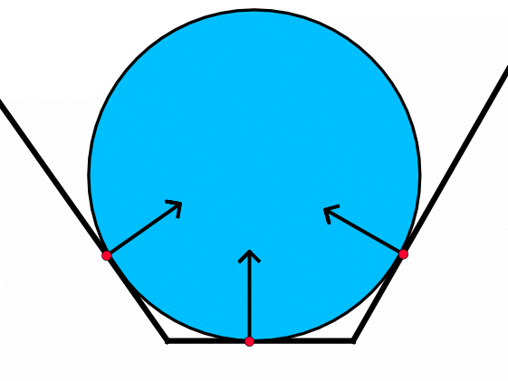

## Introduction

In this final assignment we will finally consider how to model contact between objects. Specifically we will adapt the unconstrained rigid body simulation from the [previous assignment](https://github.com/dilevin/CSC2549-a5-rigid-bodies/) to support contact resolution by solving a Linear Complimentarity Problem. 

### Prerequisite installation

On all platforms, we will assume you have installed cmake and a modern c++
compiler on Mac OS X[¹](#¹macusers), Linux[²](#²linuxusers), or
Windows[³](#³windowsusers).

We also assume that you have cloned this repository using the `--recursive`
flag (if not then issue `git submodule update --init --recursive`). 

**Note:** We only officially support these assignments on Ubuntu Linux 18.04 (the OS the teaching labs are running) and OSX 10.13 (the OS I use on my personal laptop). While they *should* work on other operating systems, we make no guarantees.  

**All grading of assignments is done on Linux 18.04**

### Layout

All assignments will have a similar directory and file layout: 

    README.md
    CMakeLists.txt
    main.cpp
    assignment_setup.h
    include/
      function1.h
      function2.h
      ...
    src/
      function1.cpp
      function2.cpp
      ...
    data/
      ...
    ...

The `README.md` file will describe the background, contents and tasks of the
assignment.

The `CMakeLists.txt` file setups up the cmake build routine for this
assignment.

The `main.cpp` file will include the headers in the `include/` directory and
link to the functions compiled in the `src/` directory. This file contains the
`main` function that is executed when the program is run from the command line.

The `include/` directory contains one file for each function that you will
implement as part of the assignment.

The `src/` directory contains _empty implementations_ of the functions
specified in the `include/` directory. This is where you will implement the
parts of the assignment.

The `data/` directory contains _sample_ input data for your program. Keep in
mind you should create your own test data to verify your program as you write
it. It is not necessarily sufficient that your program _only_ works on the given
sample data.

## Compilation for Debugging

This and all following assignments will follow a typical cmake/make build
routine. Starting in this directory, issue:

    mkdir build
    cd build
    cmake ..

If you are using Mac or Linux, then issue:

    make

## Compilation for Testing

Compiling the code in the above manner will yield working, but very slow executables. To run the code at full speed, you should compile it in release mode. Starting in the **build directory**, do the following:

    cmake .. -DCMAKE_BUILD_TYPE=Release
    
Followed by:

    make 
  
Your code should now run significantly (sometimes as much as ten times) faster. 

If you are using Windows, then running `cmake ..` should have created a Visual Studio solution file
called `a6-rigid-body-contact.sln` that you can open and build from there. Building the project will generate an .exe file.

Why don't you try this right now?

## Execution

Once built, you can execute the assignment from inside the `build/` using 

    ./a6-rigid-body-contact

While running, you can unpause/pause the simulation by pressing 's' and reset the position of the rigid body by pressing `r`. 

## Background 

In this final assignment we will augment our previous rigid body integrator with a contact resolution mechanism based on the basic laws of contact mechanics. We will begin by describing the conditions to resolve single point contact, extend this to multi point contact and then to the rigid body regime. Finally we will explore a popular, iterative scheme for solving the contact equations, the projected Gauss-Seidel method. 

## Resources

This [paper](https://animation.rwth-aachen.de/media/papers/2012-EG-STAR_Rigid_Body_Dynamics.pdf) provides a detailed overview of rigid body simulation with contact.

## Single Point Contact 

The image above illustrates the most basic setup for a contact problem. It contains a single circular object (blue disk) resting on an infinite plane (black line). There is a single point of contact between these two objects (the contact point ) and associated with this contact point is a shared surface normal (). Contact mechanics addresses the question of how two such physical objects will behave when they come into contact. 

Imagine the following scenario, our disk is falling under gravity and we've managed to take a snapshot of it just as it makes contact with our plane, but before the contact has any effect. In classical mechanics, no two pieces of matter can occupy the same region of space, our goal is to figure out how we can prevent that from happening -- how we can prevent the disc from falling through the plane. 

Since this is a physics problem we cannot directly manipulate the positions of the disk, rather all interactions happen through forces acting on either the volume (like gravity) or surface of both objects. This is a consequence of Newton's first law (objects in motion remain in motion unless influenced by an external force). We want to choose these forces so that the push the contacting objects away from each other (back into empty space, sometimes called the feasible space). To do this we are going to define a set of rules that will govern such contact mediated interactions. 

To begin, let's consider where our correcting force will come from. It arises as a consequence of Newton's third law, as the disc pushes on the floor, the floor pushes on the disc. From this arises our first rule of contact mechanics -- that the correcting force, actually the **contact force**, is only non-zero when objects are in contact. 

Now that we've defined when the contact force can be applied, we can further define its properties. The most important property of a contact force is that it cannot "pull" the contacting objects back together (its not sticky). This means that locally, the contact force needs to push the objects apart along the normal direction. Finally we need to ensure that the objects are  no longer on a collision course after applying the contact force. 

Let's try to define these conditions mathematically for a single point contacting a plane. Furthermore let's assume the plane is fixed in space and cannot move no matter how hard the disk pushes on it.  First, let's define our contact force. Since the force has to push our disk away from the floor, it has to have a component acting normal to the contact point. In fact, any force pushing in any other direction is doing nothing to resolve the potential contact. This implies that a reasonable definition of the contact force acting on the disk is , where  is a scalar. By definition this force acts normal to the contact surface. For the force to pull the disk towards the plane, it has to act in the opposite of the normal direction. To prevent this we can add the constraint .  Next, we need to make sure this force is only applied when the disk is in contact with the object. Let's create a new function  which computes the [signed distance](https://en.wikipedia.org/wiki/Signed_distance_function) between the two objects at the contact point, . If the objects are in contact then  if the disk passes into the plane,  and if the disc is not contacting the surface . Let's assume we are constraining our problem such that , then we can only apply the contact force when . This means that for each contact point either  or . If we compute  it will always be 0. This is called a [complimentarity](https://en.wikipedia.org/wiki/Complementarity_theory) condition and it is a kind of orthogonality condition. Accordingly we write this as .  These collected constraints,

are a form of the [**Signorini Conditions**](https://en.wikipedia.org/wiki/Signorini_problem) which arise in all manner of contact problems. 

## Multi Point Contact and the Equations of Motion 

Now that we have a mathematical model for a single contact point, let's extend it to multiple points. Let's imagine we have a **collison detector** which will check for collisions between all objects in our scene and return a list of collision points, collision normals and a pair of object identifiers for each contact. In the general case, when neither object in the contacting pair is fixed, we must consider the effect of the contact force on both participating bodies.  For this  contact we get 

 

where  and  index the two objects involved in this collision.  measures the distance, in world space, between the contact point on object  and the contact point on object . As we move object  and  around to try and solve this problem,the contact point  will no longer be a single point, rather it will become two points, one attached to each object. Typically we compute this by mapping the original  to the undeformed space of each object, then mapping it back to the world space as the objects move. We compute  on these new, separate points. Finally, notice that our contact forces are setup to ensure that an equal and opposite force is applied to each object at the contact point.  Each contact introduces a new set of forces on some object  and some object , along with the appropriate complimentarity constraints. 

## The Equations of Motion for a Single Rigid Body with Multiple Contacts 

Now that we have a mathematical model for contact forces, we need to combine them with our equations of motion. Since we are simulating rigid bodies, those equations will be the Newton-Euler Equations. Let's make life a little bit easier by considering only a single rigid body, colliding with fixed objects in the scene. The equations of motion tell us that inertial forces need to balance all other external forces acting on the object. The sum of all contact forces acting on a single rigid body is given by 

 

where the  depends on whether the object is  or  in the collision pair. Now  is a world space force in . We know that to convert this to a rigid body force (a torque and a center-of-mass force) we need to multiply by the transpose of the rigid body jacobian , evaluated at the appropriate undeformed point . Here  is the contact point  transformed from world into undeformed space (i.e you need to apply the inverse of the rigid body transform). This gives us the following constrained equations of motion

which we can write in matrix form as 

where  is a  matrix of stacked  matrices,  is a  matrix where each column contains a single contact normal, and  is a  vector of contact force magnitudes.  Using these matrix variables one can see that the remaining complimentarity conditions for this entire dynamic system become 

where  returns a vector of distances, one for each contact and all inequalities apply component wise to the associated vectors. 

## The Velocity Level Signorini Conditions

The system of equations and inequalities above is difficult to solve -- there is a lot of nonlinearity hidden in the calculation of the distance function. One way to side step this is to linearize the equations and solve them at the velocity level. Let's look at how this is done for a single contact. 

We begin by computing  which can be conveniently computed as . Rather than solve the nonlinear complimentarity problem above, we will solve the following [linear complimentarity problem (LCP)](https://en.wikipedia.org/wiki/Linear_complementarity_problem)

Now we need a way to relate  and  to . Fortunately we already have such a set of equations, they are the discretized equations of motion from the [previous assignment](https://github.com/dilevin/CSC2549-a5-rigid-bodies/). We have already seen that, for the rigid body .

A little bit of rearranging gives 

 

where  is the unconstrained velocity at time  (exactly what we computed for the last assignment). So now we see that, for a single contact there's a relatively simple relationship between the contact force magnitude, , and the resulting velocity.  Now we can use the rigid body jacobian to relate this to the velocity of the contact point, . At the end of each time step, the velocity of  will be

Formula's for rigid body  are analogous except rather than subtracting contact forces, we **add** them (equal and opposite :) ). 

Because we can now express  and  directly as functions of , and because these expressions encode the physical behaviour of our rigid body (via the equations of motion) we can now start to solve this complimentarity problem. Let's start by examining the inequality . 

We can now rephrase this inequality completely in terms of , which looks like this

Let's ignore the inequality and just find  such that . This is given by . That's a very convenient way to find the magnitude of the contact force that will (linearly) pull our objects so that the distance between their contacting points is zero. The problem is we've ignored all the other parts of the LCP. 

One thing that we know is  must always be greater than, or equal to , and it can only be non-zero if . One obvious thing to is compute our final contact force magnitude as 

This ensures  is always greater than zero. It also ensures this only happens when the gap between contact points is  (because that's wht we solved for). Interestingly, due to the structure of the  term, one only gets a positive  when . This means that contact forces are only applied when the objects are in contact or when one object is inside another (something which we should definitely correct for). Thus, this simple operation solves our single contact point LCP. Next we will use this as the building block of a multi-point contact handling algorithm.

## Solving the Multi-Point Contact Problem using Projected Gauss Seidel 

With multiple points things get a little trickier, we need to somehow satisfy all our complimentarity conditions at once. One way of doing this is to solve a [quadratic program](https://en.wikipedia.org/wiki/Quadratic_programming) at the velocity level. It turns out that certain LCPs (like the one we solve) define the optimality criteria for quadratic programs and solving one is the same as solving the other. For this project we will **not** solve a QP, instead we will use an iterative method ([projected Gauss-Seidel](http://www.optimization-online.org/DB_FILE/2007/06/1675.pdf)) to directly solve the LCP. This approach is extremely popular in physics-based animation and well worth understanding.

Let's imagine we have  contact points. We can augment our contact modified, rigid body update equation with them in the following manner:

 

We are going to use this equation to solve (and its counterpart for rigid bod ) to solve the contact problem by iteratively updating our 's one-at-a-time. We begin with an initial guess for each  (say ). The basic algorithm proceeds in the following manner (sorry about the non-processed latex, its a markdown thing that I cannot figure out).

    iterations = 0
    all $\alpha$ = 0

    While i < max iterations
        
        For c = 0 to number of contacts - 1
             
             Compute $\delta_c$ 

             Compute $\gamma_c$

             Compute $alpha^{i}_c = \max(0,-frac{\gamma_c}{\delta_c})$

        End
    
    End

The remaining goal is to come up with formulas for  and .  We do this in a Gauss-Seidel fashion, by dividing the contact forces into three groups -- (1) forces that have been updated this iteration, (2) forces that have yet to be updated and (3) the contact we are currently solving for. With this grouping we arrive at a formula for rigid body velocity that looks like this:

 

Note that  and  can be computed using the values of  at this particular point in the contact point iteration. Solving for the updated  is analogous to the single point case. For the contact, , we are currently visiting, we construct

We then compute . The method gets its name due to the Gauss-Seidel like ordering of the  updates and the projection of computed 's onto the set of positive, real numbers. 

While this algorithm can be run to convergence, for interactive applications it is best to limit the number of outer iterations. In our case we will set the maximum number of outer iterations to be **10**. 

## Assignment Implementation

In this assignment you will adapt your previous, unconstrained rigid body integrator to handle contact using the projected Gauss-Seidel algorithm. The notes above assume the general case in which contact forces act on two objects which are both dynamic. In the assignment your contacts will happen with a fixed ground plane which cannot move. The ground plane will not be a simulated object. Rather you will modify your projected Gauss-Seidel solver to handle such fixed objects. One way to formulate this modification is to treat static objects as having infinite mass. In this way the inverse mass matrix is zero, meaning applied forces have no effect. If the objects initial velocity is zero, it will always be zero. 

### rodrigues.cpp

**Use code from previous assignment.**

### inverse_rigid_body.cpp

A method to transform a point from world (deformed) space to body (undeformed) space. 

### rigid_body_jacobian.cpp

**Use code from previous assignment.**

### inertia_matrix.cpp

**Use code from previous assignment.**

### collision_box_floor.cpp

Detect contact between a triangle mesh and an arbitrarily positioned plane.

### dV_spring_particle_particle_dq.cpp

**Use code from previous assignment.**

### exponential_euler_lcp_contact.h

Implement velocity level collision resolution using progressive Gauss-Seidel and exponential Euler time integration. 

### pick_nearest_vertices.cpp

**Use code from previous assignment.**

